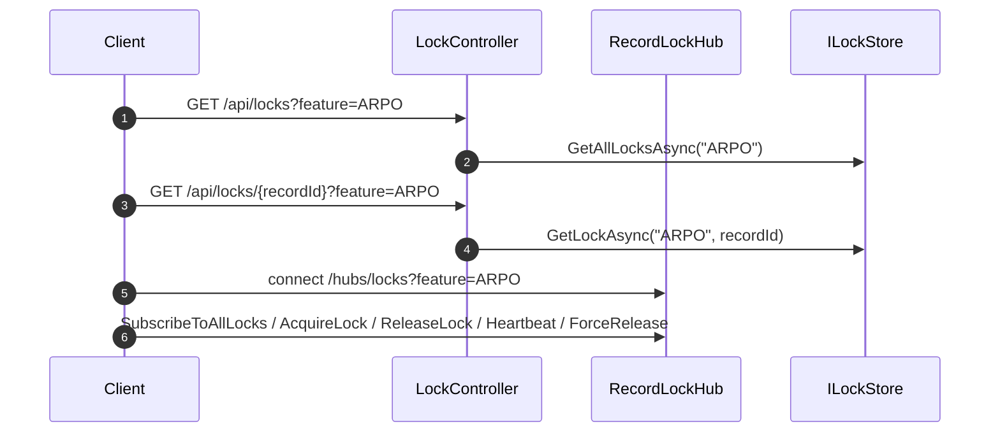

# SignalR Lock POC API Reference

## Overview
The backend exposes a small REST API for lock bootstrap and a SignalR hub for live lock operations. The hub is multi-feature by design: clients connect to `/hubs/locks?feature=<featureKey>`, and the same feature key is used by the REST controller through the `feature` query parameter.

## API Surface Map



## Authentication
There is no server-enforced authentication in the current codebase. The frontend uses `MockAuth` and passes `userId` and `displayName` directly to the hub. Treat all identity-related data in this section as POC-only.

## Common Response Codes
| Code | Meaning |
|---|---|
| 200 | Request succeeded and returned JSON payload |
| 204 | Record has no current lock |
| 400 | Not used by controller today, but appropriate for invalid request data |
| SignalR `error` event | Hub validation failure such as missing `recordId` or `userId` |

## REST Endpoints

### GET `/api/locks`

**Description:** Returns all active locks for a feature.

**Query Parameters:**
| Name | Required | Default | Description |
|---|---|---|---|
| `feature` | No | `default` | Feature key whose locks should be returned |

**Response:**
```json
[
	{
		"recordId": "INV-001",
		"lockedByUserId": "user-ab12cd",
		"lockedByDisplayName": "User 123",
		"acquiredAtUtc": "2026-04-03T08:00:00Z",
		"expiresAtUtc": "2026-04-03T08:05:00Z",
		"connectionId": "abc123"
	}
]
```

### GET `/api/locks/{recordId}`

**Description:** Returns the current lock for a specific record, or no content if unlocked.

**Path Parameters:**
| Name | Required | Description |
|---|---|---|
| `recordId` | Yes | Record identifier |

**Query Parameters:**
| Name | Required | Default | Description |
|---|---|---|---|
| `feature` | No | `default` | Feature key whose record lock should be queried |

**Response (200):** Same `LockInfo` schema as above.

**Response (204):** No body.

## SignalR Hub

### Endpoint
| Item | Value |
|---|---|
| Hub route | `/hubs/locks` |
| Feature scoping | Query string `feature=<featureKey>` |
| Group naming | `all-locks:{featureKey}` |

### Client -> Server Methods

#### `SubscribeToAllLocks()`
**Description:** Adds the connection to the feature-scoped SignalR group for lock updates.

#### `AcquireLock(recordId, userId, displayName)`
**Description:** Attempts to acquire the lock for a record.

**Parameters:**
| Name | Type | Required | Description |
|---|---|---|---|
| `recordId` | string | Yes | Record to lock |
| `userId` | string | Yes | Current user identifier |
| `displayName` | string | Yes | Name shown to other users |

**Behavior:**
- If free, creates a lock and broadcasts `lockAcquired`.
- If already owned by the same user, refreshes TTL and updates connection ID.
- If owned by another user, sends `lockRejected` to the caller.

#### `ReleaseLock(recordId)`
**Description:** Releases a lock owned by the caller's connection.

#### `Heartbeat(recordId)`
**Description:** Extends TTL for an owned lock.

#### `ForceRelease(recordId)`
**Description:** Force releases a lock regardless of owner. Current code does not enforce admin authorization server-side.

### Server -> Client Events
| Event | Payload | Recipients | Meaning |
|---|---|---|---|
| `lockAcquired` | `(recordId: string, lock: LockInfo)` | Feature group subscribers | Lock acquired or refreshed |
| `lockRejected` | `(recordId: string, lock: LockInfo)` | Caller only | Lock conflict |
| `lockReleased` | `(recordId: string)` | Feature group subscribers | Lock no longer active |
| `lockHeartbeat` | `(recordId: string, lock: LockInfo)` | Caller only | Heartbeat accepted |
| `error` | `(message: string)` | Caller only | Validation error |

## Shared Payload Schema

### `LockInfo`
| Field | Type | Description |
|---|---|---|
| `recordId` | string | Locked record identifier |
| `lockedByUserId` | string | User ID of the lock holder |
| `lockedByDisplayName` | string | Human-readable lock owner |
| `acquiredAtUtc` | string (ISO-8601) | When the lock was created |
| `expiresAtUtc` | string (ISO-8601) | Current expiry timestamp |
| `connectionId` | string | SignalR connection that currently owns the lock |

## Error Conditions
| Condition | Current Behavior |
|---|---|
| Missing `recordId` on `AcquireLock` or `ReleaseLock` | Sends `error` event |
| Missing `userId` on `AcquireLock` | Sends `error` event |
| Lock held by another user | Sends `lockRejected` with current holder |
| Releasing someone else's lock | Returns no explicit error event; release simply does nothing |

## Rate Limiting
No rate limiting or throttling is implemented in the current repository.

## Cross References
- Runtime ordering: [SEQUENCE_DIAGRAMS.md](SEQUENCE_DIAGRAMS.md)
- Lock rules: [BUSINESS_LOGIC.md](BUSINESS_LOGIC.md)

## Version History
| Version | Date | Changes |
|---|---|---|
| 1.0 | 2026-04-03 | Replaced empty placeholder with verified REST and SignalR contract documentation |
