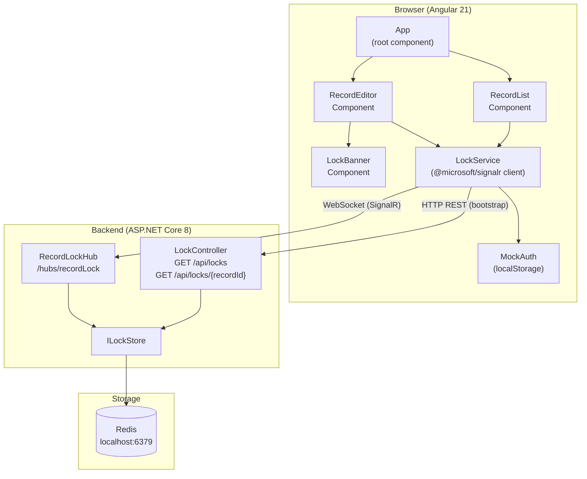
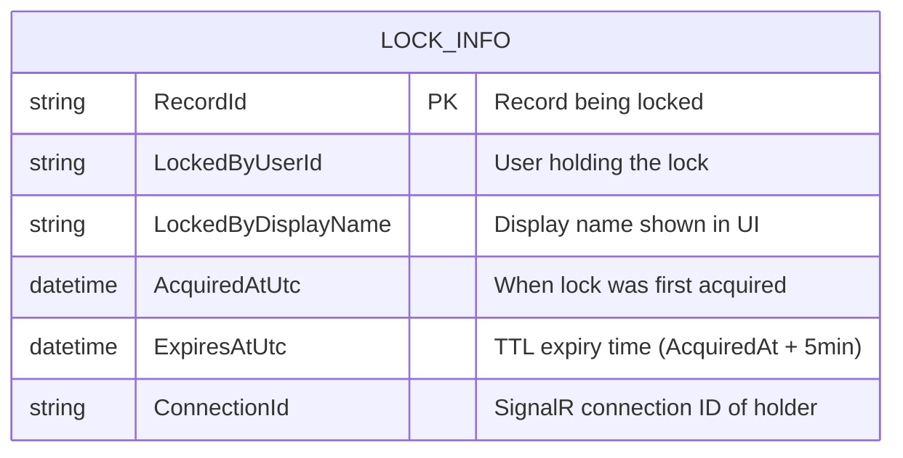
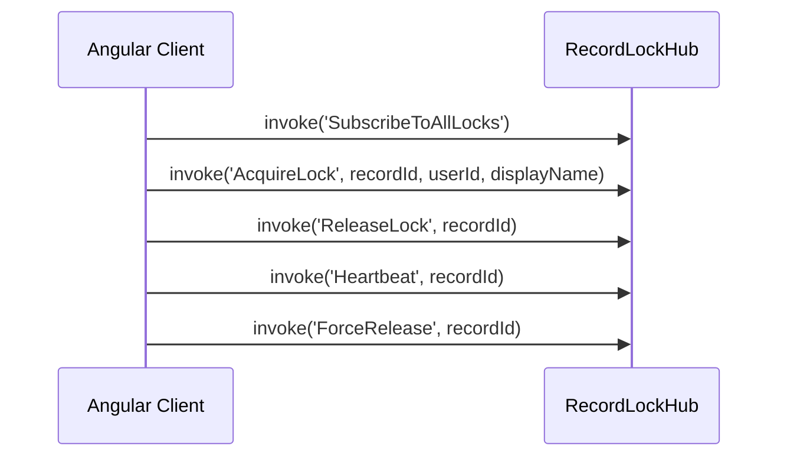
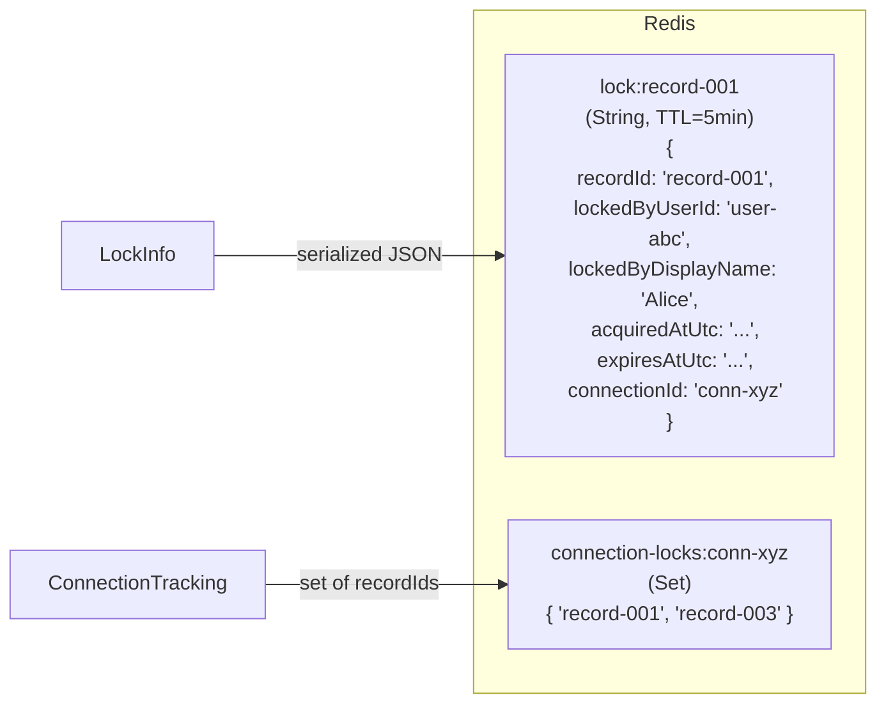
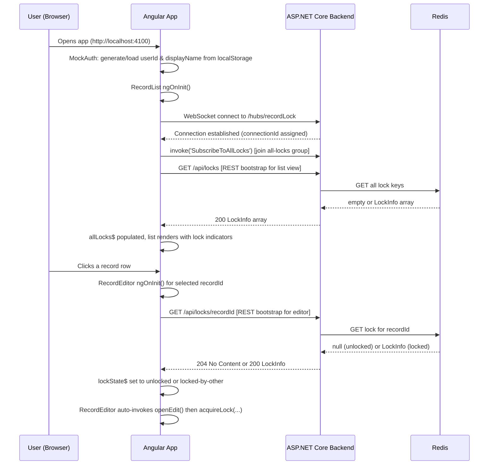
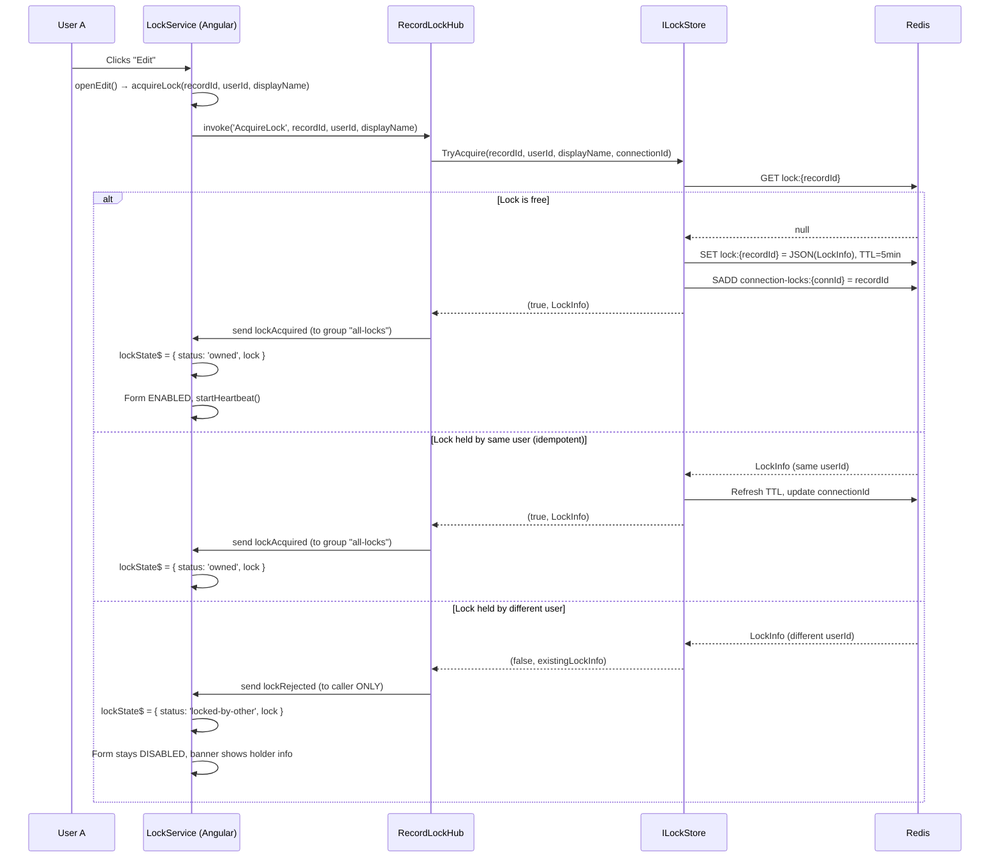
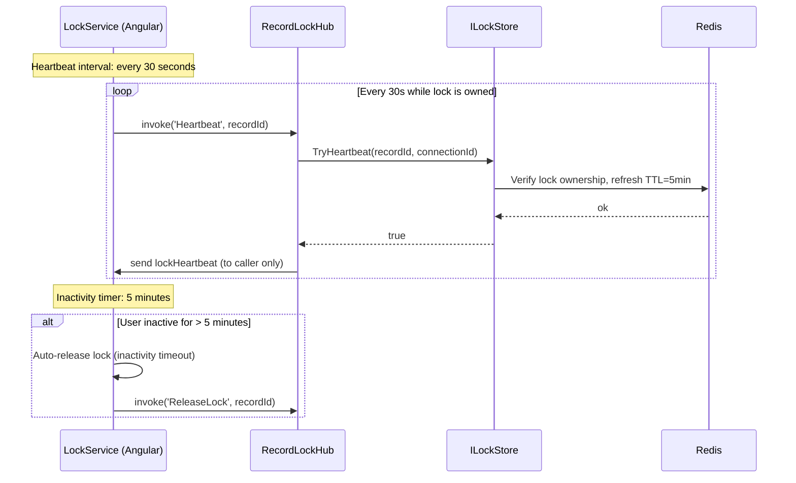
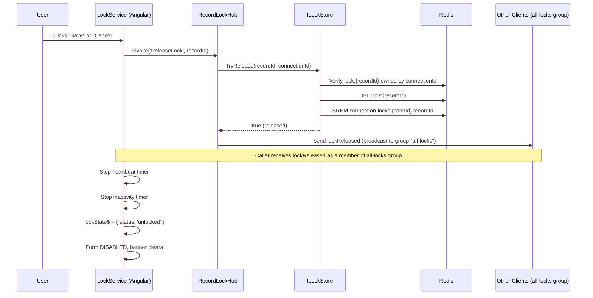
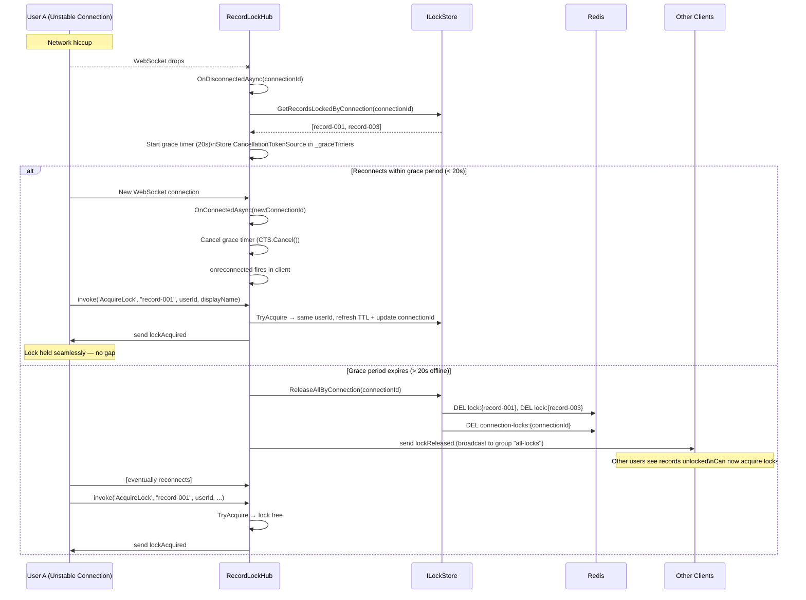

# Architecture & Functionality Flow

> **SignalR Record-Level Locking POC**  
> A real-time, record-level exclusive editing lock system using ASP.NET Core SignalR and Angular.

---

## Table of Contents

1. [High-Level Architecture](#1-high-level-architecture)
2. [Data Models](#2-data-models)
3. [SignalR Hub Contract](#3-signalr-hub-contract)
4. [Redis Data Structures](#4-redis-data-structures)
5. [Functional Flows](#5-functional-flows)
   - [Application Startup](#51-application-startup)
   - [Lock Acquisition](#52-lock-acquisition)
   - [Active Editing (Heartbeat)](#53-active-editing-heartbeat)
   - [Lock Release](#54-lock-release)
   - [Disconnect & Grace Period](#55-disconnect--grace-period)
6. [Key Design Patterns](#6-key-design-patterns)

---

## 1. High-Level Architecture

The system consists of three layers: an **Angular frontend**, an **ASP.NET Core backend** (hosting both a REST controller and a SignalR hub), and a **Redis** store that persists lock state.

---

## 2. Data Models

### `LockInfo` (shared between backend and frontend)

### `LockState` (frontend union type)

| Status | Fields | Meaning |
|--------|--------|---------|
| `unlocked` | — | Record is free to edit |
| `owned` | `lock: LockInfo` | Current user holds the lock |
| `locked-by-other` | `lock: LockInfo` | Another user holds the lock |

---

## 3. SignalR Hub Contract

### Client → Server Invocations

### Server → Client Events

| Event | Recipient | Payload | Meaning |
|-------|-----------|---------|---------|
| `lockAcquired` | Group `all-locks` | `(recordId, LockInfo)` | Lock acquired; all subscribers notified |
| `lockRejected` | Caller only | `(recordId, LockInfo)` | Acquisition failed; holder info included |
| `lockReleased` | Group `all-locks` | `(recordId)` | Lock released; record now free |
| `lockHeartbeat` | Caller only | `(recordId, LockInfo)` | TTL refreshed; updated lock info returned |
| `error` | Caller only | `(message)` | Operation failed |

---

## 4. Redis Data Structures

## 5. Functional Flows

### 5.1 Application Startup

---

### 5.2 Lock Acquisition

---

### 5.3 Active Editing (Heartbeat)

---

### 5.4 Lock Release

---

### 5.5 Disconnect & Grace Period

---

## 6. Key Design Patterns

### Pattern Summary

### 1. Single Lock Per Record
Only one user can hold a lock on any given record at a time. Redis `SET` with `NX` semantics provides atomic, race-condition-free acquisition.

### 2. Idempotent Lock Acquisition
If the same user acquires the same lock again (e.g., after reconnect), the TTL is refreshed and the connection ID is updated. No duplicate locks are created.

### 3. TTL-Based Expiration
Redis automatically expires lock keys after 5 minutes. This means stale locks (from crashed clients) are cleaned up without a background cleanup job.

### 4. Grace Period on Disconnect
When a connection drops, locks are not immediately released. A 20-second grace period allows transient network glitches to recover without disrupting the editing session. A `CancellationTokenSource` timer fires the release only if reconnection doesn't happen in time.

### 5. Connection Tracking
Redis maintains a set of `recordId`s for each `connectionId`. This enables efficient bulk release of all locks held by a connection during grace period expiry.

### 6. Single Shared Broadcast Group
All clients join a single SignalR group `all-locks` via `SubscribeToAllLocks`. Every `lockAcquired` and `lockReleased` event is broadcast to this group, so any connected client (list view or editor) immediately sees lock changes across all records without needing per-record group subscriptions.

### 7. REST Bootstrap + WebSocket Updates
On page load, lock state is fetched via REST before WebSocket events begin. The list view calls `GET /api/locks` (all active locks) to populate its initial state. The editor calls `GET /api/locks/{recordId}` when a record is selected. Both calls prevent state gaps while the WebSocket handshake is in progress.

---
