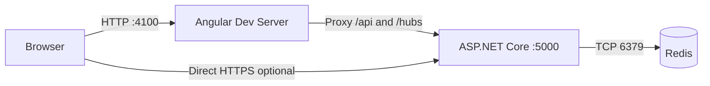

# SignalR Lock POC System Architecture

## Overview
This repository implements a record-level exclusive locking proof of concept for collaborative editing. An Angular 21 frontend displays records and edit forms, an ASP.NET Core 8 backend exposes both REST bootstrap endpoints and a SignalR hub, and Redis persists lock state using feature-scoped key namespaces.

## System Classification
| Attribute | Value |
|---|---|
| System type | Web application with real-time backend |
| Architectural style | SPA + API + SignalR hub |
| Deployment model | Two-process development setup: Angular dev server and ASP.NET Core API |
| State management | Browser-local reactive state plus Redis lock persistence |
| Multi-feature design | Single hub endpoint with `feature` query parameter |

## High-Level Architecture Diagram

```mermaid
graph TB
    subgraph Client[Client Layer]
        App[Angular App]
        List[RecordList]
        Editor[RecordEditor]
        Banner[LockBanner]
        Auth[MockAuth]
        Service[LockService]
        App --> List
        App --> Editor
        Editor --> Banner
        List --> Service
        Editor --> Service
        Service --> Auth
    end

    subgraph Api[Backend Layer]
        Controller[LockController<br/>GET /api/locks<br/>GET /api/locks/{recordId}]
        Hub[RecordLockHub<br/>/hubs/locks]
        Store[ILockStore]
        Config[LockFeaturesConfig]
        Controller --> Store
        Hub --> Store
        Hub --> Config
    end

    subgraph Data[Data Layer]
        Redis[(Redis)]
        Store --> Redis
    end

    Service -- REST bootstrap --> Controller
    Service -- SignalR/WebSocket --> Hub
```

## Technology Stack

### Frontend
| Component | Technology | Version |
|---|---|---|
| Application framework | Angular | 21.2.0 |
| Build tooling | Angular CLI / `@angular/build` | 21.2.1 |
| Language | TypeScript | 5.9.2 |
| Reactive streams | RxJS | 7.8.0 |
| SignalR client | `@microsoft/signalr` | 10.0.0 |
| Unit test runtime | Vitest | 4.0.8 |

### Backend
| Component | Technology | Version |
|---|---|---|
| Web runtime | ASP.NET Core | net8.0 |
| Real-time transport | SignalR | ASP.NET Core 8 built-in |
| Lock persistence | StackExchange.Redis | 2.11.8 |
| Test framework | xUnit | 2.5.3 |
| Integration test host | Microsoft.AspNetCore.Mvc.Testing | 8.0.0 |

## Service Catalog
| Service | Port / Route | Primary Responsibilities |
|---|---|---|
| Angular dev server | `http://localhost:4100` | Serves SPA, proxies `/api` and `/hubs` |
| ASP.NET Core HTTP profile | `http://localhost:5000` | REST endpoints, SignalR hub, CORS policy |
| ASP.NET Core HTTPS profile | `https://localhost:7180` | Optional HTTPS development endpoint |
| SignalR hub | `/hubs/locks` | List subscription, acquire/release, heartbeat, force release |
| Lock bootstrap API | `/api/locks` | Query active locks by feature or record |
| Redis | `localhost:6379` | Stores lock JSON values and connection-to-record sets |

## Deployment Architecture



## Communication Patterns
| Pattern | Participants | Usage |
|---|---|---|
| Request/response | Angular `HttpClient` -> `LockController` | Bootstrap current lock state before or alongside hub connection |
| Persistent bidirectional messaging | Angular SignalR client -> `RecordLockHub` | Subscribe to lock updates and send lock operations |
| Shared persistent state | `RecordLockHub` / `LockController` -> `ILockStore` -> Redis | Centralized lock ownership, TTL, and disconnect cleanup |
| In-process reactive updates | `LockService` -> components via `BehaviorSubject` | Push record lock state and aggregate lock map into the UI |

## Storage Architecture
| Key Pattern | Value Type | Purpose |
|---|---|---|
| `lock:{featureKey}:{recordId}` | JSON serialized `LockInfo` with TTL | Active lock per record and feature |
| `connection-locks:{featureKey}:{connectionId}` | Redis set of record IDs | Tracks records held by a connection for grace-period release |

## Security Boundaries
| Boundary | Notes |
|---|---|
| Browser identity boundary | Current user identity is created or loaded in `MockAuth` from `localStorage` |
| API boundary | CORS allows only `http://localhost:4100` and `https://localhost:4100` in the checked-in config |
| Hub boundary | Feature key is supplied by query string and determines SignalR group scoping |
| Data boundary | Redis stores lock ownership, connection ID, and TTL-backed expiry metadata |

## Design Decisions
| Decision | Rationale |
|---|---|
| Single hub endpoint with feature key | Avoids one hub per feature while preserving namespace isolation |
| REST bootstrap before / alongside SignalR | Prevents stale UI during connection establishment or refresh |
| Redis-backed `ILockStore` | Enables shared lock state across backend instances compared with in-memory storage |
| Idempotent reacquire by same user | Supports reconnect and connection ID replacement without false lock conflicts |
| Grace-period disconnect handling | Avoids premature release during transient network drops |

## Constraints And Risks
| Item | Impact |
|---|---|
| Mock browser auth | Client can currently supply identity values; not production-safe |
| No backplane configuration beyond Redis lock store | SignalR scale-out strategy is not yet documented or implemented here |
| Query-string feature selection | Backend trusts feature names but does not validate feature membership or authorization |
| Redis server selection in `GetAllLocksAsync` | Uses first configured server; operational assumptions should be reviewed for clustered deployments |

## Cross References
- API details: [API_REFERENCE.md](API_REFERENCE.md)
- Runtime workflows: [SEQUENCE_DIAGRAMS.md](SEQUENCE_DIAGRAMS.md)
- Configuration: [CONFIGURABLE_DESIGN.md](CONFIGURABLE_DESIGN.md)
- Lock rules: [BUSINESS_LOGIC.md](BUSINESS_LOGIC.md)

## Version History
| Version | Date | Changes |
|---|---|---|
| 1.0 | 2026-04-03 | Replaced partial architecture draft with repository-accurate system architecture |
