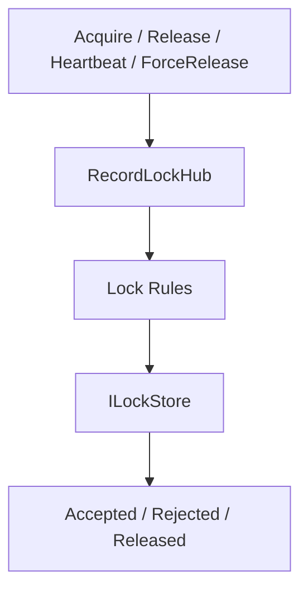
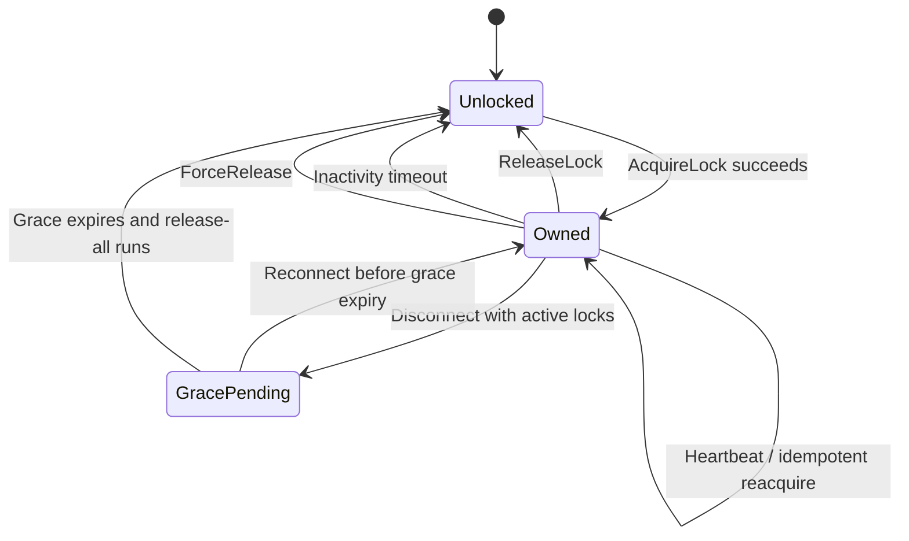

# SignalR Lock POC Business Logic Documentation

## Overview
The core business logic in this repository is the lock lifecycle. A record can be unlocked, owned by the current user, or owned by another user. Lock operations are feature-scoped, time-bounded, and tied to a SignalR connection for release authorization.

## Logic Architecture

## Lock State Model

## Rule Categories
| Category | Rule | Source |
|---|---|---|
| Feature scoping | Every lock operation is evaluated within a feature key | `RecordLockHub.GetFeatureKey`, query string feature |
| Exclusivity | Only one active lock per `featureKey + recordId` | Redis key namespace design |
| Reacquire behavior | Same `userId` may reacquire its own lock and refresh TTL | `TryAcquireAsync` |
| Release ownership | Standard release requires matching `connectionId` | `TryReleaseAsync` |
| Heartbeat ownership | TTL can be refreshed only by matching `connectionId` | `TryHeartbeatAsync` |
| Admin override | Force release bypasses ownership checks | `ForceReleaseAsync` and hub `ForceRelease` |
| Disconnect safety | Lock is not immediately released on disconnect if grace period is configured | `OnDisconnectedAsync` |

## Detailed Rules

### Acquire Rule
| Condition | Outcome |
|---|---|
| No existing lock | Acquire succeeds and creates new `LockInfo` |
| Existing lock belongs to same `userId` | Acquire succeeds, TTL is refreshed, `connectionId` may change |
| Existing lock belongs to another user | Acquire fails and current lock is returned |

### Release Rule
| Condition | Outcome |
|---|---|
| Caller owns lock by `connectionId` | Lock is removed |
| Caller does not own lock | No release occurs |
| Record has no lock | No release occurs |

### Heartbeat Rule
| Condition | Outcome |
|---|---|
| Caller owns lock by `connectionId` | TTL and `expiresAtUtc` are refreshed |
| Caller does not own lock | Heartbeat is ignored |
| Lock missing or expired | Heartbeat is ignored |

### Disconnect Rule
| Condition | Outcome |
|---|---|
| Connection disconnects with no active locks | No deferred work |
| Connection disconnects with active locks | Start grace timer and defer release |
| Connection reconnects before grace expiry | Cancel pending release |
| Grace period expires | Release all locks owned by the disconnected connection |

## Timing Rules
| Rule | Current Default |
|---|---|
| Lock TTL | 300000 ms |
| Grace period | 20000 ms |
| Heartbeat interval | 30000 ms |
| Client inactivity auto-release | 300000 ms |

## Business Risks
| Risk | Explanation |
|---|---|
| Identity spoofing | Same-user reacquire is based on client-supplied `userId` in current POC |
| Force-release privilege gap | UI exposes admin intent, but hub does not enforce role checks |
| Hardcoded feature usage in UI | Current components use `ARPO` directly rather than injected feature config |

## Operational Guidance
| Scenario | Recommended Handling |
|---|---|
| User reports lock cannot be released | Check Redis key, connection ownership, and whether grace timer is pending |
| Lock survives page close | Verify `beforeunload` best-effort call and grace-period timer behavior |
| Same user reconnects | Expected behavior is idempotent reacquire with new connection ID |

## Cross References
- API contracts: [API_REFERENCE.md](API_REFERENCE.md)
- Configuration values: [CONFIGURABLE_DESIGN.md](CONFIGURABLE_DESIGN.md)
- Security implications: [DATA_SECURITY.md](DATA_SECURITY.md)

## Version History
| Version | Date | Changes |
|---|---|---|
| 1.0 | 2026-04-03 | Added explicit lock lifecycle rules, state transitions, and timing rules |