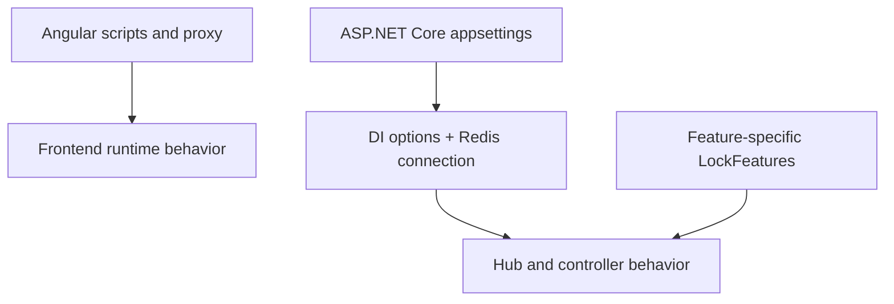

# SignalR Lock POC Configurable Design

## Overview
The repository supports configuration at several layers: Angular dev-server runtime settings, ASP.NET Core app settings, per-feature lock timing options, and standard .NET environment variable overrides.

## Configuration Layers



## Checked-In Configuration Sources
| File | Scope | Notes |
|---|---|---|
| `frontend/signalr-lock-ui/package.json` | Frontend scripts and package versions | `start` runs Angular dev server on port 4100 |
| `frontend/signalr-lock-ui/angular.json` | Angular build/serve targets | Development serve target uses `proxy.conf.json` |
| `frontend/signalr-lock-ui/proxy.conf.json` | Frontend API proxy | Proxies `/api` and `/hubs` to `http://localhost:5000` |
| `backend/SignalRLock.Api/appsettings.json` | Backend runtime defaults | Redis connection and lock timing options |
| `backend/SignalRLock.Api/Properties/launchSettings.json` | Development launch profiles | HTTP on 5000 and HTTPS on 7180 |

## Configurable Parameters
| Parameter | Default | Valid Range / Format | Source | Purpose |
|---|---|---|---|---|
| `Redis:Connection` | `localhost:6379` | Redis connection string | `appsettings.json` | Connect backend to Redis |
| `LockFeatures:Default:LockTtlMs` | `300000` | Positive integer milliseconds | `appsettings.json` | Default lock TTL |
| `LockFeatures:Default:GracePeriodMs` | `20000` | Positive integer milliseconds | `appsettings.json` | Disconnect grace period |
| `LockFeatures:Default:HeartbeatIntervalMs` | `30000` | Positive integer milliseconds | `appsettings.json` | Client heartbeat hint / server expectation |
| `LockFeatures:Features:purchase-orders:LockTtlMs` | `300000` | Positive integer milliseconds | `appsettings.json` | Feature override example |
| `LockFeatures:Features:purchase-orders:GracePeriodMs` | `20000` | Positive integer milliseconds | `appsettings.json` | Feature-specific grace period |
| `LockFeatures:Features:purchase-orders:HeartbeatIntervalMs` | `30000` | Positive integer milliseconds | `appsettings.json` | Feature-specific heartbeat interval |
| Angular serve port | `4100` | TCP port | `package.json` | Frontend development host |
| Backend HTTP port | `5000` | TCP port | `launchSettings.json` | Backend development endpoint |
| Backend HTTPS port | `7180` | TCP port | `launchSettings.json` | Optional secure development endpoint |

## Current Frontend Runtime Constants
These values are currently hardcoded in the frontend implementation and should be externalized if the POC becomes a reusable product module.

| Constant | Value | File | Recommendation |
|---|---|---|---|
| `HUB_BASE_URL` | `/hubs/locks` | `services/lock.ts` | Keep as configurable environment value |
| `HEARTBEAT_INTERVAL_MS` | `30000` | `services/lock.ts` | Align with backend `LockFeatures` config |
| `INACTIVITY_TIMEOUT_MS` | `300000` | `services/lock.ts` | Make feature-specific if screens differ |
| Feature key in components | `ARPO` | `record-list.ts`, `record-editor.ts` | Replace with injected feature key or route-level config |

## Environment Variable Equivalents
ASP.NET Core supports overriding config keys with environment variables using double underscores.

| Config Key | Environment Variable |
|---|---|
| `Redis:Connection` | `Redis__Connection` |
| `LockFeatures:Default:LockTtlMs` | `LockFeatures__Default__LockTtlMs` |
| `LockFeatures:Default:GracePeriodMs` | `LockFeatures__Default__GracePeriodMs` |
| `LockFeatures:Default:HeartbeatIntervalMs` | `LockFeatures__Default__HeartbeatIntervalMs` |
| `LockFeatures:Features:purchase-orders:LockTtlMs` | `LockFeatures__Features__purchase-orders__LockTtlMs` |

## Example Configurations

### Backend JSON
```json
{
  "Redis": {
    "Connection": "localhost:6379"
  },
  "LockFeatures": {
    "Default": {
      "LockTtlMs": 300000,
      "GracePeriodMs": 20000,
      "HeartbeatIntervalMs": 30000
    },
    "Features": {
      "purchase-orders": {
        "LockTtlMs": 300000,
        "GracePeriodMs": 20000,
        "HeartbeatIntervalMs": 30000
      }
    }
  }
}
```

### Backend Environment Variables
```bash
Redis__Connection=redis.example.internal:6379
LockFeatures__Default__LockTtlMs=300000
LockFeatures__Default__GracePeriodMs=20000
LockFeatures__Default__HeartbeatIntervalMs=30000
```

### Proxy Configuration
```json
{
  "/api": {
    "target": "http://localhost:5000",
    "secure": false,
    "changeOrigin": true
  },
  "/hubs": {
    "target": "http://localhost:5000",
    "secure": false,
    "changeOrigin": true,
    "ws": true
  }
}
```

## Best Practices
| Practice | Reason |
|---|---|
| Keep frontend timing constants aligned with backend feature config | Avoid premature client release or mismatched heartbeat cadence |
| Externalize feature key instead of hardcoding `ARPO` | Make the locking module reusable across features |
| Use environment variable overrides for deployment-specific Redis hosts | Avoid committing environment-specific values |
| Keep grace period larger than reconnect window | Prevent releasing locks during short network interruptions |

## Manual Review Areas
| Area | Reason |
|---|---|
| No environment-specific Angular files are present in the repo snapshot | Frontend configuration is partly hardcoded |
| Launch profiles still point `launchUrl` to `weatherforecast` | Likely stale scaffolding value |

## Cross References
- Timing rules: [BUSINESS_LOGIC.md](BUSINESS_LOGIC.md)
- Architecture: [ARCHITECTURE.md](ARCHITECTURE.md)

## Version History
| Version | Date | Changes |
|---|---|---|
| 1.0 | 2026-04-03 | Added concrete configuration inventory, env-var mappings, and hardcoded frontend constants |