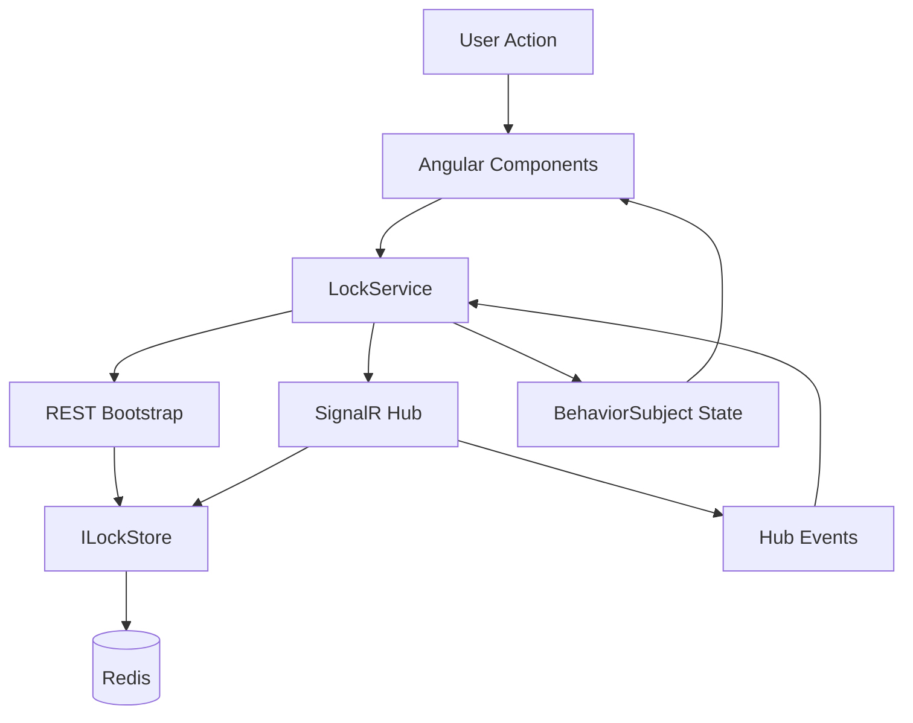
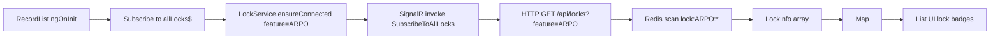
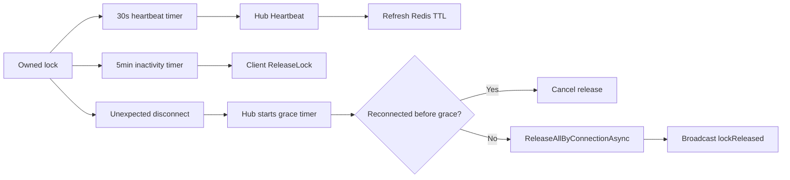

# SignalR Lock POC Data Flow Documentation

## Overview
The system moves lock state through two channels: REST bootstrap calls used to fetch the current truth on initial load, and SignalR events used to maintain live state after the connection is established. Redis is the source of truth for active locks, while Angular components consume derived client-side state from `BehaviorSubject` streams.

## High-Level Data Flow



## Core Data Flow Scenarios

### Scenario 1: List View Bootstrap And Live Subscription



**Steps:**
1. `RecordList` subscribes to `allLocks$` and marks the view for change detection whenever the map changes.
2. `LockService` opens or reuses a SignalR connection scoped to the feature key.
3. The client invokes `SubscribeToAllLocks` on the hub.
4. The client issues `GET /api/locks?feature=<feature>` to load the current active lock set.
5. The returned `LockInfo[]` is transformed into a `Map<string, LockInfo>` keyed by record ID.

**Error handling:**
- If the REST bootstrap fails, the UI still listens for later hub events.
- If the SignalR connection is unavailable, the list may show stale or empty state until reconnect succeeds.

### Scenario 2: Editor Open And Lock Acquisition

```mermaid
flowchart LR
    A[RecordEditor ngOnInit or recordId change] --> B[GET /api/locks/{recordId}?feature=ARPO]
    B --> C{Existing lock?}
    C -->|No| D[State unlocked]
    C -->|Yes| E[State locked-by-other]
    D --> F[AcquireLock recordId userId displayName]
    F --> G[Hub -> ILockStore.TryAcquireAsync]
    G --> H{Free or same owner?}
    H -->|Yes| I[Store LockInfo with TTL]
    I --> J[Broadcast lockAcquired]
    H -->|No| K[Send lockRejected]
```

**Steps:**
1. `RecordEditor` bootstraps the current lock for the selected record via REST.
2. The editor calls `openEdit`, which invokes `AcquireLock` using the current mock user.
3. The hub delegates to `ILockStore.TryAcquireAsync` with the current connection ID and feature-specific TTL.
4. The store either creates or refreshes a lock, or returns the conflicting lock holder.
5. The client updates form enabled/disabled state based on the resulting `LockState`.

**Error handling:**
- Missing `recordId` or `userId` causes an `error` event to the caller.
- Acquisition conflict produces `lockRejected` with the current holder metadata.

### Scenario 3: Heartbeat, Inactivity Timeout, And Grace-Period Disconnect Release



**Steps:**
1. While a lock is owned, `LockService` sends `Heartbeat` every 30 seconds.
2. `TryHeartbeatAsync` refreshes the lock expiry only if the caller still owns the lock.
3. Browser activity listeners reset a five-minute inactivity timer.
4. Inactivity triggers a client-side `ReleaseLock`.
5. Unexpected disconnect triggers server-side grace-period handling before forcefully releasing locks by connection.

**Error handling:**
- Failed heartbeat leaves expiry to Redis TTL semantics.
- If a disconnected client reconnects in time, the pending grace release is canceled.

## Data Transformation Pipeline
| Stage | Input | Transformation | Output |
|---|---|---|---|
| REST bootstrap | `LockInfo[]` JSON | Array to `Map<string, LockInfo>` | Aggregate list state |
| Hub event: `lockAcquired` | `(recordId, lock)` | Insert or replace map entry | Live list state |
| Hub event: `lockReleased` | `recordId` | Delete map entry | Live list state |
| Hub event: `lockRejected` | `(recordId, lock)` | Set current record state to `locked-by-other` | Disabled editor state |
| Hub event: `lockAcquired` for current record | `(recordId, lock)` | Compare `lockedByUserId` with current user | `owned` or `locked-by-other` |

## Integration Data Flows
| Integration | Protocol | Purpose |
|---|---|---|
| Angular -> ASP.NET Core controller | HTTP via dev proxy | Read current lock state for record or feature |
| Angular -> SignalR hub | WebSocket / SignalR negotiation | Subscribe and issue lock commands |
| ASP.NET Core -> Redis | RESP via StackExchange.Redis | Persist TTL-backed lock records and connection sets |

## Cross References
- System topology: [ARCHITECTURE.md](ARCHITECTURE.md)
- Detailed runtime order: [SEQUENCE_DIAGRAMS.md](SEQUENCE_DIAGRAMS.md)
- Event and endpoint contracts: [API_REFERENCE.md](API_REFERENCE.md)

## Version History
| Version | Date | Changes |
|---|---|---|
| 1.0 | 2026-04-03 | Added repository-specific bootstrap, acquisition, and disconnect-release flows |