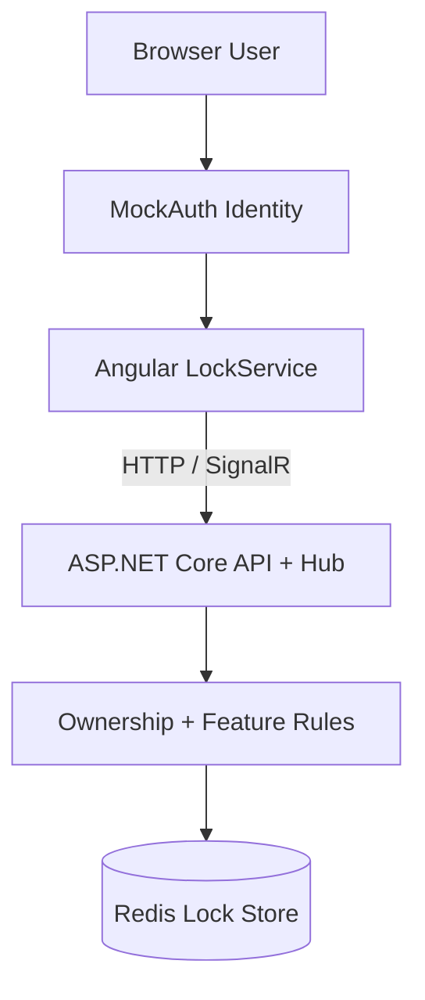

# SignalR Lock POC Data Security Documentation

## Overview
The current repository demonstrates real-time locking behavior, not a production-ready identity and authorization stack. Security-relevant behavior exists in the CORS policy, feature-scoped hub grouping, lock ownership checks, Redis persistence, and admin force-release capabilities.

## Security Architecture

## Authentication Mechanism
| Area | Current Implementation | Security Notes |
|---|---|---|
| Frontend identity | `MockAuth` creates or restores a user from `localStorage` | Suitable only for demos |
| Hub calls | `AcquireLock` accepts `userId` and `displayName` from the client | Server currently trusts caller-supplied identity |
| REST calls | No auth middleware in `Program.cs` | Bootstrap endpoints are unauthenticated in current code |

## Authorization Model
| Operation | Current Rule | Enforced Where |
|---|---|---|
| Acquire lock | Allowed if lock is absent or already held by same `userId` | `ILockStore.TryAcquireAsync` |
| Release lock | Allowed only if the caller's `connectionId` owns the lock | `TryReleaseAsync` |
| Heartbeat | Allowed only if the caller's `connectionId` owns the lock | `TryHeartbeatAsync` |
| Force release | Any connected caller can invoke the hub method | Hub method exists; no server-side role check yet |
| List subscription | Scoped to SignalR group `all-locks:{featureKey}` | `RecordLockHub.SubscribeToAllLocks` |

## Encryption
| Aspect | Current State | Recommendation |
|---|---|---|
| In transit | HTTP on `:5000` is the default dev path; HTTPS is also available in launch settings | Enforce HTTPS/WSS outside local development |
| At rest in Redis | Not defined in repo | Use managed Redis with encryption at rest and secured network access |
| Browser storage | Plain `localStorage` | Replace with secure auth tokens or cookies managed by a real identity provider |

## Network Security
| Control | Current State |
|---|---|
| CORS | Policy `AngularDev` allows `http://localhost:4100` and `https://localhost:4100` with credentials |
| Hub endpoint | `/hubs/locks` |
| REST endpoints | `/api/locks`, `/api/locks/{recordId}` |
| Redis connection | `localhost:6379` from appsettings |

## Recommended Security Headers
The current repo does not configure explicit security headers in `Program.cs`. For any production deployment, add at least the following:

| Header | Purpose |
|---|---|
| `Strict-Transport-Security` | Force HTTPS |
| `Content-Security-Policy` | Reduce XSS exposure |
| `X-Content-Type-Options: nosniff` | Prevent MIME confusion |
| `X-Frame-Options: DENY` or CSP `frame-ancestors` | Prevent clickjacking |

## Audit Logging
| Event | Current State | Recommendation |
|---|---|---|
| Lock acquired | Informational application log exists | Include actor, feature, record, and outcome |
| Lock released | Informational application log exists | Add structured audit sink if retained long-term |
| Force release | Warning log exists | Treat as privileged event with actor identity |
| Failed acquire | No explicit audit record beyond rejection behavior | Add security-relevant audit event |
| Unauthorized operation | Not applicable yet because auth is absent | Required once auth is added |

## Incident Response Considerations
| Incident | Immediate Response |
|---|---|
| Stuck lock | Use force release, verify connection cleanup, inspect Redis keys |
| Identity spoofing | Disable mock auth flow and move to server-issued identity |
| Redis exposure | Rotate credentials, restrict network, inspect lock payload leakage |
| Unexpected unlocks | Inspect reconnect and grace-period logs for race conditions |

## Hardening Backlog
| Item | Priority |
|---|---|
| Replace mock auth with ASP.NET Core authentication and `Context.User` | High |
| Validate admin role server-side before `ForceRelease` | High |
| Add authorization for feature access | High |
| Require HTTPS/WSS in non-dev environments | High |
| Add structured audit trail | Medium |
| Protect Redis with credentials/TLS | Medium |

## Cross References
- PII inventory: [PII_DATA.md](PII_DATA.md)
- Lock lifecycle rules: [BUSINESS_LOGIC.md](BUSINESS_LOGIC.md)
- Endpoints and methods: [API_REFERENCE.md](API_REFERENCE.md)

## Version History
| Version | Date | Changes |
|---|---|---|
| 1.0 | 2026-04-03 | Added current-state security architecture and production hardening guidance |