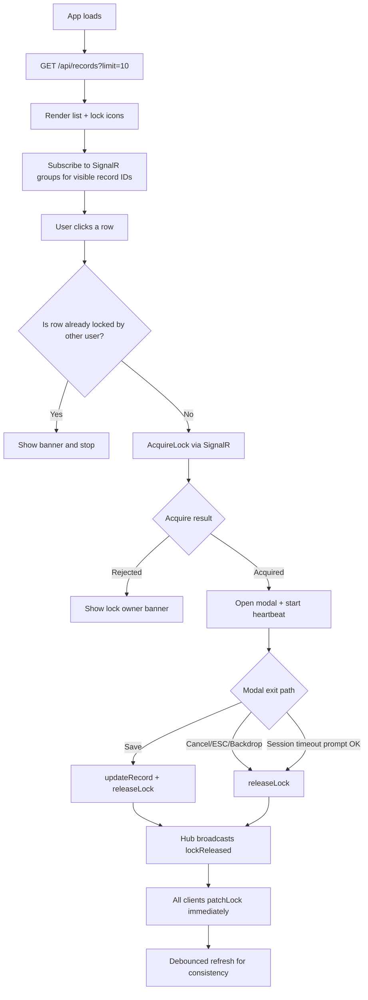
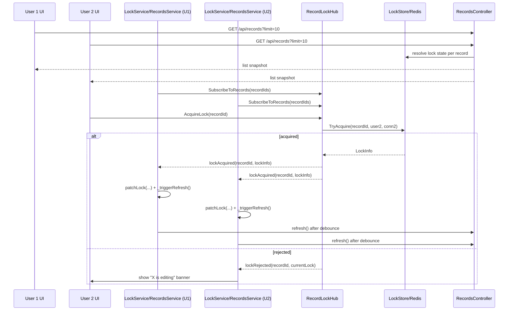

# Project Functionality Flow (File + Function Wise)

> **SignalR Record-Level Locking POC**
> Functional flow documentation focused on app behavior and exact code locations.

---

## 1) What this app does

The application allows many users to see the same records, but only one user can edit a given record at a time.

- If record is free → user can open modal and edit.
- If record is locked by another user → editing is blocked and user sees message.
- Lock status updates live for all users through SignalR broadcasts.
- If lock is lost (disconnect / inactivity / taken by other user), modal shows timeout prompt and closes safely.

---

## 2) Functional Broadway Diagram

---

## 3) File and function mapping

## 3.1 Frontend flow owner files

| File | Responsibility | Key Functions |
|---|---|---|
| `frontend/signalr-lock-ui/src/app/app.ts` | App shell orchestration | `ngOnInit`, `onOpenRecord`, `onDialogClosed` |
| `frontend/signalr-lock-ui/src/app/services/records.service.ts` | List state (signals) and row updates | `refresh`, `patchLock`, `updateRecord` |
| `frontend/signalr-lock-ui/src/app/services/lock.ts` | SignalR client + lock lifecycle | `acquireLock`, `releaseLock`, `releaseLockWithRetry`, `startHeartbeat`, `_registerHubHandlers` |
| `frontend/signalr-lock-ui/src/app/components/records-list/records-list.component.ts` | Table interactions | `onRowClick`, `lockClass`, `lockTooltip` |
| `frontend/signalr-lock-ui/src/app/components/record-dialog/record-dialog.component.ts` | Editing modal + timeout handling | `save`, `cancel`, `acknowledgeSessionTimeout`, `_onLockStateChanged`, `_closeWithRelease` |

## 3.2 Backend flow owner files

| File | Responsibility | Key Functions |
|---|---|---|
| `backend/SignalRLock.Api/Hubs/RecordLockHub.cs` | Real-time lock API + broadcasts | `SubscribeToRecords`, `AcquireLock`, `ReleaseLock`, `Heartbeat`, `OnDisconnectedAsync`, `BroadcastReleasesAsync` |
| `backend/SignalRLock.Api/Controllers/RecordsController.cs` | List endpoint for table snapshot | `GET /api/records?limit=...` |
| `backend/SignalRLock.Api/Services/LockStore.cs` (+ impl) | Lock source-of-truth + TTL/ownership | `TryAcquire`, `TryRelease`, `TryHeartbeat`, `GetLock`, `ReleaseAllByConnection` |

---

## 4) Detailed runtime sequence (technical)

---

## 5) Session timeout behavior in modal

Modal shows **Session timed out** prompt when any of below occurs:

1. `connectionLost = true` input arrives.
2. Lock state transitions from `owned` to `unlocked` (inactivity timeout flow).
3. Lock state transitions from `owned` to `locked-by-other` (lock stolen/changed flow).

Then user clicks **OK**:

- Calls `acknowledgeSessionTimeout()`
- Goes through `_closeWithRelease(false)`
- Emits `closed` event to shell
- Modal closes and shell clears selected record

Code location:

- `frontend/.../record-dialog.component.ts`
  - `ngOnChanges`
  - `_onLockStateChanged`
  - `_showSessionTimeoutPrompt`
  - `acknowledgeSessionTimeout`

---

## 6) Why list refresh happens for passive users

Even if user does nothing, list still refreshes because:

1. Hub broadcast event arrives (`lockAcquired` / `lockReleased`).
2. `lock.ts` handler runs `_triggerRefresh()`.
3. `_refreshTrigger$` debounced pipeline calls `recordsService.refresh(10)`.

So sync is **broadcast-driven**, not click-driven.

---

## 7) Quick troubleshooting map

| Symptom | First file to inspect | Typical function |
|---|---|---|
| Row lock icon not changing | `services/lock.ts` | `_registerHubHandlers` |
| List not refreshing after event | `services/lock.ts`, `services/records.service.ts` | `_triggerRefresh`, `refresh` |
| Modal not closing on timeout | `components/record-dialog/*.ts` | `_onLockStateChanged`, `acknowledgeSessionTimeout` |
| Broadcast not reaching other user | `backend/Hubs/RecordLockHub.cs` | `Clients.Group(...).SendAsync(...)` |

---

## 8) Key takeaway

Functionally, this project is a **real-time exclusive edit workflow** where:

- SignalR broadcasts deliver instant lock events,
- `patchLock()` updates UI immediately,
- debounced `refresh()` confirms consistency,
- and modal close/release paths keep lock ownership safe.
