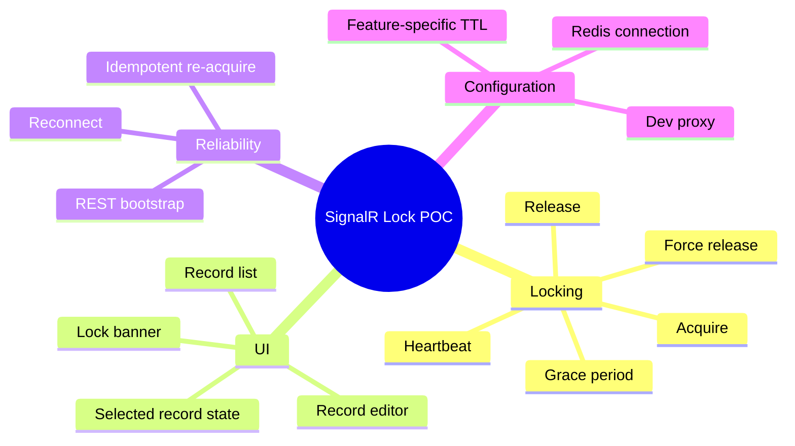

# SignalR Lock POC Features List

## Overview
The repository already implements the core exclusive-editing workflow and several operational protections such as heartbeat renewal, reconnect reacquisition, and disconnect grace handling. The table below inventories both delivered and implied roadmap behaviors.

## Feature Inventory
| # | Feature | Category | Status | Notes |
|---|---|---|---|---|
| 1 | Record list display | UI | IMPLEMENTED | Lists mock records with current selection |
| 2 | Record editor form | UI | IMPLEMENTED | Allows editing when lock is owned |
| 3 | Lock ownership banner | UI | IMPLEMENTED | Shows owned or blocked state |
| 4 | Record selection eventing | UI | IMPLEMENTED | `recordSelected` emitted from list to root component |
| 5 | Lock badge evaluation in list | UI | IMPLEMENTED | Detects self vs other ownership using current user ID |
| 6 | Bootstrap current record lock via REST | Realtime | IMPLEMENTED | `GET /api/locks/{recordId}` |
| 7 | Bootstrap all locks via REST | Realtime | IMPLEMENTED | `GET /api/locks` |
| 8 | Live all-lock subscription | Realtime | IMPLEMENTED | Hub `SubscribeToAllLocks` + group subscription |
| 9 | Exclusive acquire lock | Realtime | IMPLEMENTED | Rejects if another user owns the record |
| 10 | Idempotent reacquire by same owner | Realtime | IMPLEMENTED | Refreshes TTL and updates connection ID |
| 11 | Explicit release on save | Realtime | IMPLEMENTED | Triggered from editor save flow |
| 12 | Explicit release on cancel | Realtime | IMPLEMENTED | Triggered from editor cancel flow |
| 13 | Best-effort release on component destroy | Realtime | IMPLEMENTED | `ngOnDestroy` release attempt |
| 14 | Best-effort release on `beforeunload` | Realtime | IMPLEMENTED | Browser unload hook |
| 15 | Heartbeat TTL renewal | Reliability | IMPLEMENTED | 30-second heartbeat while owned |
| 16 | Client inactivity auto-release | Reliability | IMPLEMENTED | 5-minute inactivity timeout |
| 17 | Grace-period disconnect recovery | Reliability | IMPLEMENTED | Server waits before releasing disconnected locks |
| 18 | Automatic reconnect support | Reliability | IMPLEMENTED | SignalR automatic reconnect |
| 19 | Lock reassertion after reconnect | Reliability | IMPLEMENTED | Re-invokes `AcquireLock` when still owned |
| 20 | Admin force unlock action | Security / Ops | IMPLEMENTED | UI button + hub `ForceRelease` |
| 21 | Feature-specific lock timings | Configuration | IMPLEMENTED | `LockFeatures:Features:{key}` |
| 22 | Redis-backed persistent store | Infrastructure | IMPLEMENTED | `RedisLockStore` is wired in DI |
| 23 | In-memory test store | Testing | IMPLEMENTED | `InMemoryLockStore` used in xUnit tests |
| 24 | Concurrency safety test coverage | Testing | IMPLEMENTED | Confirms only one concurrent acquire succeeds |
| 25 | Real authentication and authorization | Security | IN PROGRESS | Not implemented in current code |
| 26 | Server-side admin authorization | Security | PLANNED | Needed for production force release |
| 27 | Feature membership authorization | Security | PLANNED | Feature key is not yet access-controlled |
| 28 | Structured audit history | Compliance | PLANNED | Logging exists, durable audit trail does not |
| 29 | Production Redis hardening | Infrastructure | PLANNED | TLS/auth/network isolation not configured here |
| 30 | Route-based multi-page navigation | UX | NOT PLANNED | App routing module is empty in current POC |

## Status Summary
| Status | Count |
|---|---|
| IMPLEMENTED | 24 |
| IN PROGRESS | 1 |
| PLANNED | 4 |
| NOT PLANNED | 1 |

## Cross References
- Lock rules: [BUSINESS_LOGIC.md](BUSINESS_LOGIC.md)
- Module inventory: [MODULES_LIST.md](MODULES_LIST.md)

## Version History
| Version | Date | Changes |
|---|---|---|
| 1.0 | 2026-04-03 | Added 30-feature inventory with implementation status |