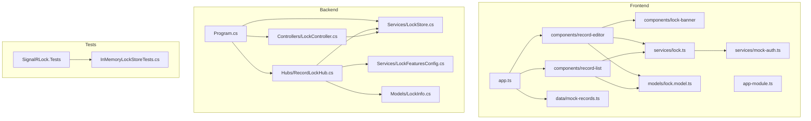

# SignalR Lock POC Modules List

## Overview
This document inventories the major modules present in the repository, their responsibilities, their dependencies, and their relationship to the lock workflow.

## Module Map

## Frontend Modules
| Module | Path | Responsibilities | Dependencies |
|---|---|---|---|
| Root app component | `frontend/signalr-lock-ui/src/app/app.ts` | Holds record list and selected record state | `MockAuth`, `MOCK_RECORDS` |
| Angular module | `frontend/signalr-lock-ui/src/app/app-module.ts` | Declares app, list, editor, banner; provides HTTP client | Angular browser/forms modules |
| Routing module | `frontend/signalr-lock-ui/src/app/app-routing-module.ts` | Initializes router with empty route table | Angular router |
| Record list | `frontend/signalr-lock-ui/src/app/components/record-list/record-list.ts` | Shows records, subscribes to all-lock map, emits selection | `LockService`, `MockAuth`, `LockInfo` |
| Record editor | `frontend/signalr-lock-ui/src/app/components/record-editor/record-editor.ts` | Bootstraps record lock, edits form, save/cancel/force unlock flows | `LockService`, `MockAuth`, `LockState`, reactive forms |
| Lock banner | `frontend/signalr-lock-ui/src/app/components/lock-banner/lock-banner.ts` | Displays current owner and optional admin action | `LockInfo` |
| Lock service | `frontend/signalr-lock-ui/src/app/services/lock.ts` | SignalR lifecycle, REST bootstrap, heartbeat, inactivity release, reconnect | `HttpClient`, `NgZone`, `MockAuth`, `@microsoft/signalr`, RxJS |
| Mock auth | `frontend/signalr-lock-ui/src/app/services/mock-auth.ts` | Creates/stores current user in local storage | Browser `localStorage` |
| Lock models | `frontend/signalr-lock-ui/src/app/models/lock.model.ts` | Shared frontend `LockInfo` and `LockState` types | None |
| Mock records data | `frontend/signalr-lock-ui/src/app/data/mock-records.ts` | Sample invoices and customer records | None |

## Backend Modules
| Module | Path | Responsibilities | Dependencies | Database Usage |
|---|---|---|---|---|
| Composition root | `backend/SignalRLock.Api/Program.cs` | DI registration, Redis connection, CORS, controller and hub mapping | ASP.NET Core, StackExchange.Redis | Connects to Redis `localhost:6379` by default |
| REST bootstrap controller | `backend/SignalRLock.Api/Controllers/LockController.cs` | Returns current locks for a feature or record | `ILockStore` | Reads active locks via store abstraction |
| SignalR hub | `backend/SignalRLock.Api/Hubs/RecordLockHub.cs` | Tracks feature key, group subscription, acquire/release, heartbeat, grace release | `ILockStore`, `LockFeaturesConfig`, `ILogger`, SignalR | Delegates lock operations to store |
| Lock model | `backend/SignalRLock.Api/Models/LockInfo.cs` | Canonical lock payload shape | None | Serialized into Redis values |
| Feature config | `backend/SignalRLock.Api/Services/LockFeaturesConfig.cs` | Resolves default and per-feature timing options | `LockStoreOptions` | None |
| Lock store abstraction and Redis implementation | `backend/SignalRLock.Api/Services/LockStore.cs` | Lock acquire/release/heartbeat/get/get-all APIs | `IConnectionMultiplexer`, `IDatabase`, JSON serializer | Stores keys `lock:{feature}:{recordId}` and `connection-locks:{feature}:{connectionId}` |
| In-memory lock store | `backend/SignalRLock.Api/Services/InMemoryLockStore.cs` | Test/development implementation of `ILockStore` | Concurrent collections, logging | Uses in-memory dictionaries only |

## Test Modules
| Module | Path | Responsibilities |
|---|---|---|
| Backend test project | `backend/SignalRLock.Tests/SignalRLock.Tests.csproj` | xUnit-based unit and component testing for lock behavior |
| In-memory lock store tests | `backend/SignalRLock.Tests/InMemoryLockStoreTests.cs` | Covers acquire, release, force release, heartbeat, expiry, release-all, and concurrent acquire |

## Documentation And Support Artifacts
| Module | Path | Purpose |
|---|---|---|
| Root README | `README.md` | Repository quick start and high-level architecture summary |
| User stories | `docs/USER_STORIES.md` | Product/user requirement capture |

## External Dependencies
| Dependency | Used By | Purpose |
|---|---|---|
| Angular | Frontend app | Component model and rendering |
| RxJS | Frontend `LockService` and components | Reactive state propagation |
| SignalR client/server | Frontend and backend | Real-time messaging |
| StackExchange.Redis | Backend store | Persistent distributed lock state |
| xUnit | Backend tests | Behavior verification |

## Cross References
- Architecture: [ARCHITECTURE.md](ARCHITECTURE.md)
- APIs: [API_REFERENCE.md](API_REFERENCE.md)
- Configuration: [CONFIGURABLE_DESIGN.md](CONFIGURABLE_DESIGN.md)

## Version History
| Version | Date | Changes |
|---|---|---|
| 1.0 | 2026-04-03 | Added complete frontend, backend, test, and support module inventory |