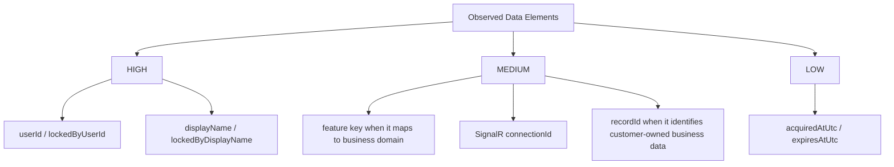

# SignalR Lock POC PII Data Documentation

## Overview
The repository is a POC, but it still processes personally identifiable information in both frontend state and backend lock records. The main PII consists of user identifiers and display names used to show lock ownership to other users.

## PII Classification Levels

## PII Inventory
| Field | Location | Classification | Sensitivity | Reason |
|---|---|---|---|---|
| `userId` | `MockAuth`, `AcquireLock` payload, `LockInfo` | Direct user identifier | HIGH | Stable identifier for ownership checks |
| `displayName` | `MockAuth`, `AcquireLock` payload | Direct personal identifier | HIGH | Displayed to other users in lock banner |
| `lockedByUserId` | Backend and frontend `LockInfo` | Direct user identifier | HIGH | Exposed as active lock owner |
| `lockedByDisplayName` | Backend and frontend `LockInfo` | Direct personal identifier | HIGH | Rendered in blocked-user banner |
| `connectionId` | Backend and frontend `LockInfo` | Session-linked identifier | MEDIUM | Traces lock ownership to a SignalR session |
| `recordId` | REST and hub methods, Redis keys | Business identifier | MEDIUM | May indirectly identify customer or account data depending on domain |
| `feature` / feature key | Hub query string, REST query string | Business context | MEDIUM | Reveals screen or domain context such as `purchase-orders` |
| `acquiredAtUtc`, `expiresAtUtc` | `LockInfo` | Operational metadata | LOW | Not sensitive alone, but contributes to user activity history |

## Current Handling
| Concern | Current Implementation |
|---|---|
| Browser storage | `MockAuth` stores user object in `localStorage` under `mockUser` |
| In-transit exposure | Identity values are sent as SignalR method arguments from the browser |
| At-rest storage | Redis stores serialized `LockInfo` values, including display name and connection ID |
| UI exposure | `LockBanner` displays `lockedByDisplayName` to blocked users |

## Protection Requirements
| Sensitivity | Required Controls |
|---|---|
| HIGH | Authenticated access only, avoid plaintext logs, encrypt at rest where feasible, minimize retention |
| MEDIUM | Scope by feature and user authorization, limit operational visibility, redact in external reporting |
| LOW | Standard operational controls and log retention rules |

## Masking And Logging Rules
| Field | UI Rule | Logging Rule |
|---|---|---|
| `userId` | Do not display raw user IDs to end users | Hash or suppress in production logs |
| `displayName` | Display only where lock ownership needs to be shown | Avoid storing outside operational audit logs |
| `connectionId` | Do not display in UI | Keep internal-only for diagnostics |
| `recordId` | Display only if already part of the business UI | Avoid mixing with identity in unrestricted logs |

## Encryption Guidance
| Layer | Current State | Target State |
|---|---|---|
| Browser local persistence | Plain `localStorage` | Replace with server-issued session or token-based auth |
| SignalR / HTTP transport | Development proxy and ASP.NET Core profiles; HTTPS available in launch settings | Enforce HTTPS/WSS in production |
| Redis data at rest | Not specified in repository | Use managed Redis encryption at rest or disk encryption in hosting platform |

## Retention Guidance
| Data | Current Retention Behavior | Recommended Policy |
|---|---|---|
| Active lock payloads | Kept until Redis TTL expiry or explicit release | Keep only while operationally necessary |
| Connection lock sets | Kept until disconnect cleanup or release | Same as active lock lifetime |
| Browser mock user | Persistent until local storage is cleared | Remove in production implementation |
| Audit events | Not implemented in repo | Retain 30 to 365 days based on policy and regulation |

## Compliance Mapping
| Requirement | GDPR | CCPA | HIPAA | Status |
|---|---|---|---|---|
| Data minimization | Applicable | Applicable | Context-dependent | Partial: only limited identity fields are used |
| Access restriction | Applicable | Applicable | Applicable if PHI-adjacent | Partial: no production auth yet |
| Deletion / right to erasure | Applicable | Applicable | Context-dependent | Not implemented |
| Auditability | Recommended | Recommended | Strongly recommended | Not implemented |

## Manual Review Areas
| Area | Reason |
|---|---|
| Whether display names may be considered internal-only or customer-visible | Impacts disclosure policy |
| Redis deployment encryption settings | Not represented in repo config |
| Production data retention plan | POC does not define log or snapshot retention |

## Cross References
- Security controls: [DATA_SECURITY.md](DATA_SECURITY.md)
- Lock payload shape: [API_REFERENCE.md](API_REFERENCE.md)

## Version History
| Version | Date | Changes |
|---|---|---|
| 1.0 | 2026-04-03 | Added PII inventory and protection guidance for lock metadata and mock identity storage |