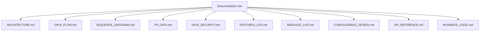

# SignalR Lock POC Documentation

## Overview
This documentation set describes the SignalR-based record locking proof of concept in this repository. The system combines an Angular 21 frontend with an ASP.NET Core 8 backend and Redis-backed lock storage to support exclusive editing, real-time lock visibility, heartbeat-based lease extension, and grace-period recovery after disconnects.

## Quick Reference By Audience

### Developers
| Document | Purpose |
|---|---|
| [ARCHITECTURE.md](ARCHITECTURE.md) | System topology, technologies, ports, and deployment model |
| [MODULES_LIST.md](MODULES_LIST.md) | File-level module inventory and responsibilities |
| [API_REFERENCE.md](API_REFERENCE.md) | REST and SignalR contract details |
| [SEQUENCE_DIAGRAMS.md](SEQUENCE_DIAGRAMS.md) | End-to-end runtime workflows |
| [CONFIGURABLE_DESIGN.md](CONFIGURABLE_DESIGN.md) | App settings, feature timings, and runtime configuration |

### Security And Compliance Reviewers
| Document | Purpose |
|---|---|
| [PII_DATA.md](PII_DATA.md) | PII inventory, sensitivity classification, retention guidance |
| [DATA_SECURITY.md](DATA_SECURITY.md) | Authentication model, transport security, logging, incident handling |
| [BUSINESS_LOGIC.md](BUSINESS_LOGIC.md) | Lock ownership rules and admin override behavior |

### Product And Architecture Reviewers
| Document | Purpose |
|---|---|
| [FEATURES_LIST.md](FEATURES_LIST.md) | Delivered and planned behaviors |
| [DATA_FLOW.md](DATA_FLOW.md) | Data movement across UI, hub, REST, and Redis |
| [ARCHITECTURE.md](ARCHITECTURE.md) | High-level design and system boundaries |

## Document Inventory
| File | Summary |
|---|---|
| [ARCHITECTURE.md](ARCHITECTURE.md) | Client/server/storage topology, technology versions, ports, boundaries |
| [DATA_FLOW.md](DATA_FLOW.md) | Bootstrap, live-update, and disconnect-release data flows |
| [SEQUENCE_DIAGRAMS.md](SEQUENCE_DIAGRAMS.md) | Six core interaction sequences with success and failure branches |
| [PII_DATA.md](PII_DATA.md) | User identity fields, local storage use, lock metadata sensitivity |
| [DATA_SECURITY.md](DATA_SECURITY.md) | Current POC security model and production hardening gaps |
| [FEATURES_LIST.md](FEATURES_LIST.md) | Feature inventory with implementation status |
| [MODULES_LIST.md](MODULES_LIST.md) | Backend, frontend, test, and docs module breakdown |
| [CONFIGURABLE_DESIGN.md](CONFIGURABLE_DESIGN.md) | Redis, lock timing, CORS, launch, and environment options |
| [API_REFERENCE.md](API_REFERENCE.md) | REST endpoints, SignalR methods/events, payload schema |
| [BUSINESS_LOGIC.md](BUSINESS_LOGIC.md) | Lock lifecycle rules, timing rules, and force-release policy |

## Diagram Types Used
| Diagram Type | Documents |
|---|---|
| Component graph | [ARCHITECTURE.md](ARCHITECTURE.md), [MODULES_LIST.md](MODULES_LIST.md), [DATA_SECURITY.md](DATA_SECURITY.md) |
| Flowchart | [DATA_FLOW.md](DATA_FLOW.md), [CONFIGURABLE_DESIGN.md](CONFIGURABLE_DESIGN.md), [FEATURES_LIST.md](FEATURES_LIST.md) |
| Sequence diagram | [SEQUENCE_DIAGRAMS.md](SEQUENCE_DIAGRAMS.md), [API_REFERENCE.md](API_REFERENCE.md) |
| State / rules diagram | [BUSINESS_LOGIC.md](BUSINESS_LOGIC.md) |
| Data classification diagram | [PII_DATA.md](PII_DATA.md) |

## Manual Review Areas
| Area | Reason |
|---|---|
| Production authentication | Current implementation uses mock browser identity only |
| Production Redis security | `localhost:6379` is configured with no auth in repo defaults |
| Launch profile landing page | `weatherforecast` is still present in launch settings even though no matching endpoint is documented |
| Operational rate limits | No throttling or abuse controls are defined in code |

## Version History
| Version | Date | Changes |
|---|---|---|
| 1.0 | 2026-04-03 | Initial repository-wide documentation set generated from current codebase |