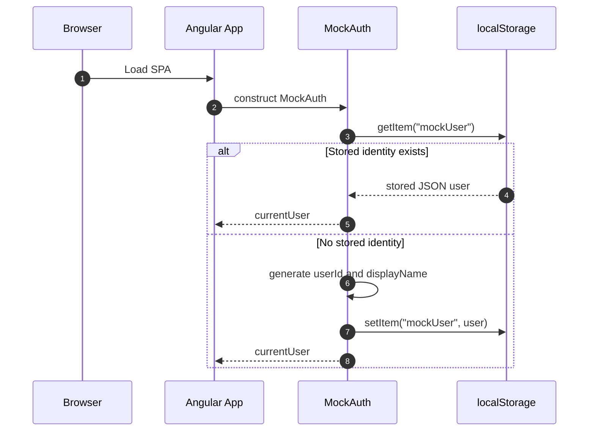
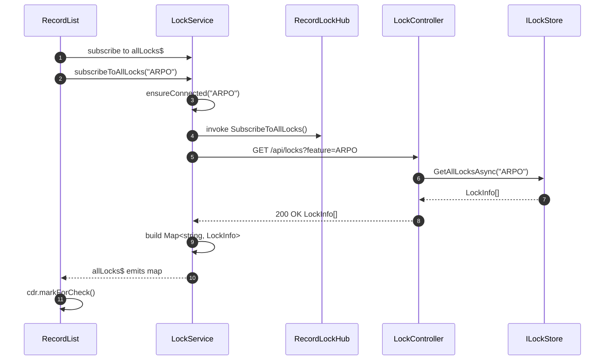
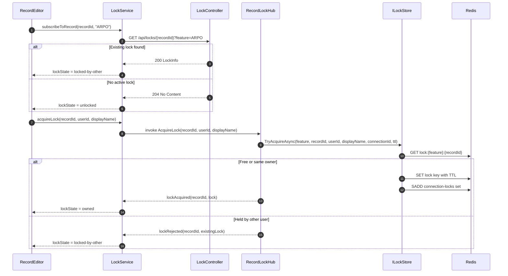
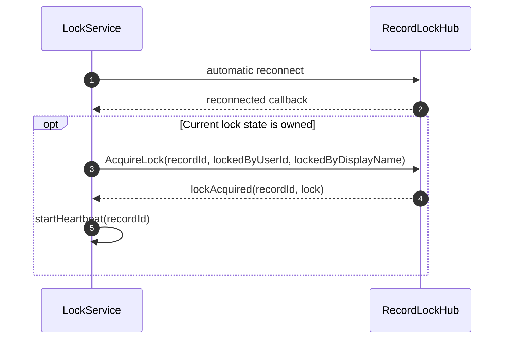
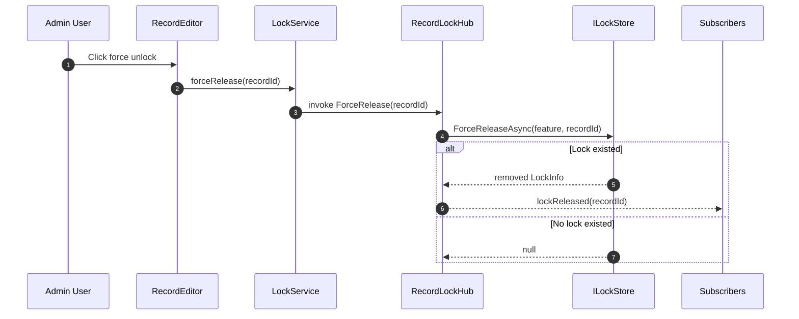

# SignalR Lock POC Sequence Diagrams

## Overview
These diagrams cover the main runtime behaviors in the repository: identity initialization, list subscription, editor acquisition, reconnect handling, disconnect grace release, and admin force release.

## 1. Authentication And Frontend Initialization



## 2. List View Subscription And Bootstrap



## 3. Record Open And Lock Acquisition



## 4. Reconnect And Lock Reassertion



## 5. Disconnect With Grace Period And Deferred Release

```mermaid
sequenceDiagram
    autonumber
    participant Client as Browser Connection
    participant Hub as RecordLockHub
    participant Store as ILockStore
    participant Group as SignalR Group Subscribers

    Client-xHub: disconnect
    Hub->>Store: GetRecordsLockedByConnectionAsync(feature, connectionId)
    alt No held locks
        Hub->>Hub: complete disconnect immediately
    else Held locks exist
        Hub->>Hub: start CancellationTokenSource grace timer
        opt Client reconnects before grace expiry
            Hub->>Hub: cancel grace timer
        else Grace expires
            Hub->>Store: ReleaseAllByConnectionAsync(feature, connectionId)
            loop Each released lock
                Hub-->>Group: lockReleased(recordId)
            end
        end
    end
```

## 6. Admin Force Release



## Cross References
- System structure: [ARCHITECTURE.md](ARCHITECTURE.md)
- Endpoint and event details: [API_REFERENCE.md](API_REFERENCE.md)
- Lock rules: [BUSINESS_LOGIC.md](BUSINESS_LOGIC.md)

## Version History
| Version | Date | Changes |
|---|---|---|
| 1.0 | 2026-04-03 | Added six sequence diagrams covering bootstrap, acquisition, reconnect, release, and admin override |